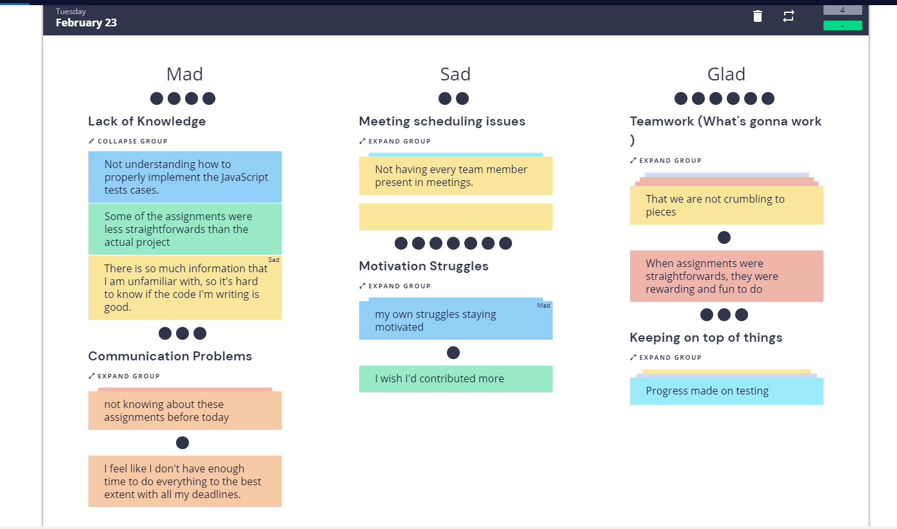

# MVP Sprint Retrospective Summary

### Average Results for Team Radar:
- Clarity: 3.7
- Autonomy: 4.4
- Mastery: 3.6
- Meaning: 3.7
- Impact: 4.0
- Engagement: 3.9

Overall, the overall team mood is good. Most team members agreed on how they felt about all these factors. Team members felt most strongly that they were able to have autonomy over their own work. Team members also felt like their work was engaging and impactful. A little bit lower on the scale is clarity about work, sense of mastery, and sense of meaning in work. Seeing that most team members came into this with little to no experience, this is expected. Not much direction was given in this project, so we had to take the initiative to learn about to do everything. 

### Mad, Sad, Glad

The main things that we agreed about is that we are all facing issues with staying motivated and that
we all agree that the team is working well together. Some other things that were voted on was that
our lack of knowledge was resulting in some difficulties with assignments, code, and test cases and that there were some issues with communication resulting in us not knowing about assignments before the day that they were due. Furthermore, we were glad that we were able to keep on top of things, but we were
sad that there were sometimes scheduling issues for meetings.

### Outstanding Action Items

In response to our mad, sad, and glad points, we came up with some action points to implement next sprint:
- In response to a point that said that someone felt like they were not contributing enough, we suggested to check Github for issues that are open or talk to sub-teams that might need help to self-assign tasks, talk to member if you want to do their task or help them with it. 
- 

What to do:
Make sure to note high points and keep artifacts from your retrospective for your sprint planning and to include in your Status Video which is a separate assignment.  

Important Note:  You must perform your retrospective meeting BEFORE you start your next sprint and after you have done your sprint review meeting. 

ake sure to note high points and keep artifacts from your retrospective for your sprint planning

