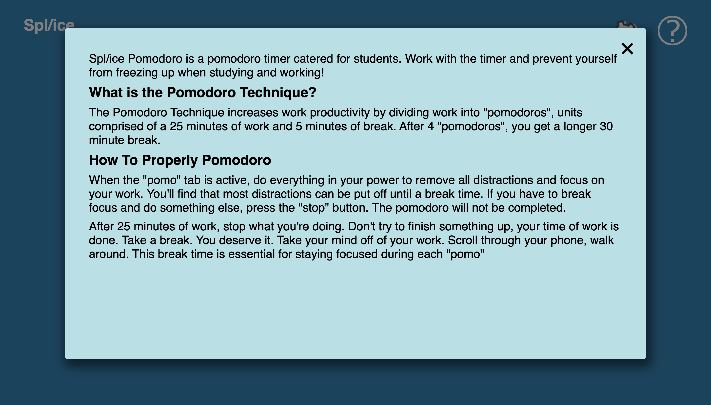
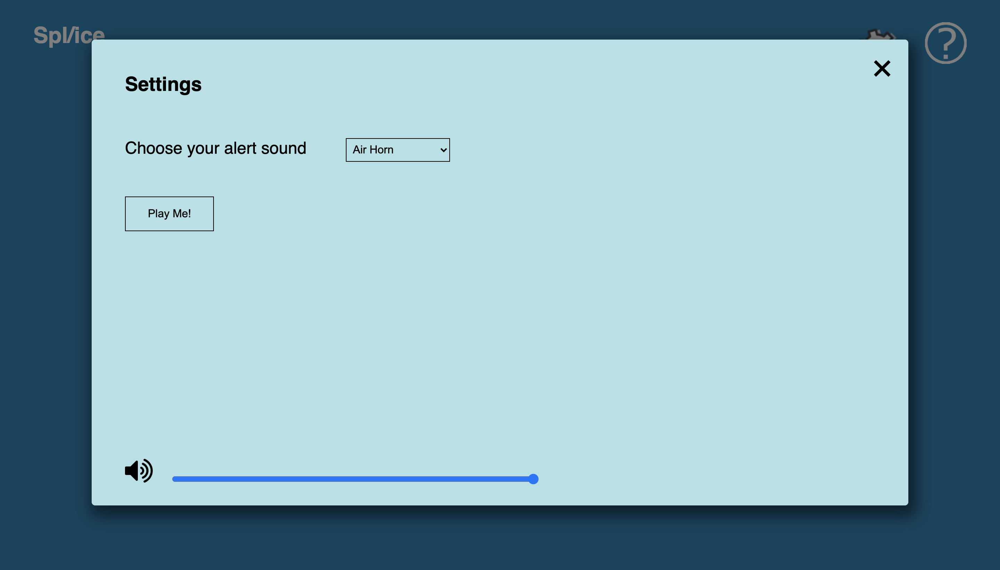
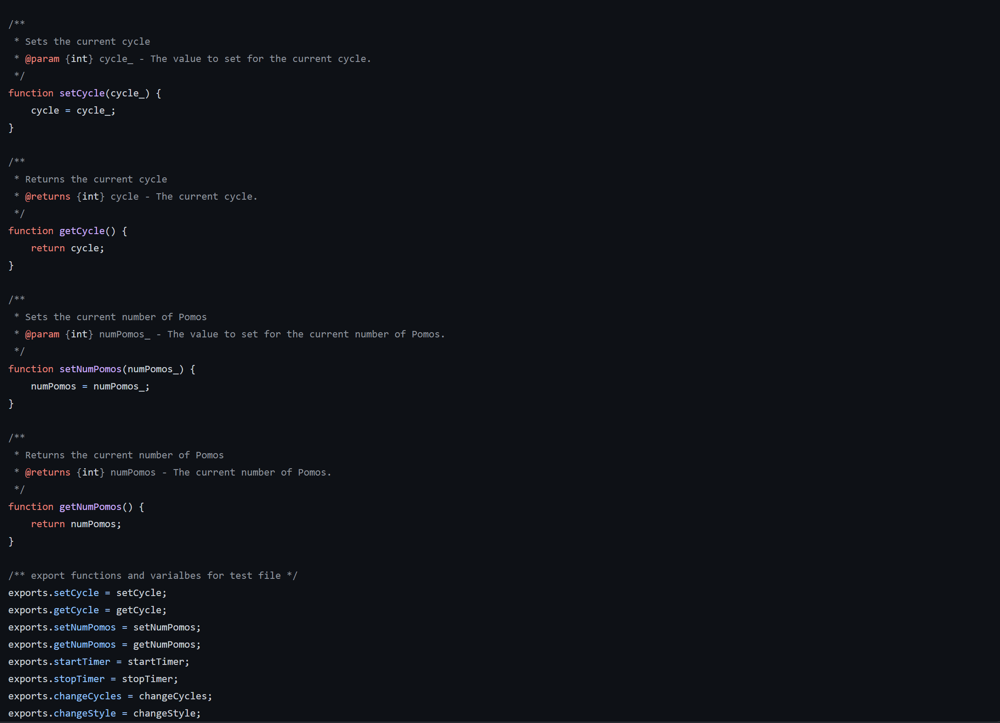

Each member should attend and speak in the meeting and notes, screen captures or even demo videos should be taken.  Attendance should be noted in your meeting notes and the high points saved 

Attendance: Elizabeth, Stephen, Eric, Wilson, Nathan, Jason, Elliot, Ellie
Unattendence: Zane(had work)

### Ellie
- Organize github issues

- Organize sprint sub tasks based on priority and workload
- Build the pipelines specifically the wiki page and jest and helped on the other ones
- Update the adr as we went along

### Elizabeth Morris
- Helped with pipeline outlining and setup. Created initial pipeline diagram.
  
- Cleaned up, read through, and formatted base CSS code following Eric's initial implementations
- Switched id to class selectors where needed
- Minor tweaks to CSS on base page and popups (both help and settings)
<!--  -->

### Eric Pham

- Set up the original file structure
- Wrote the initial accessible HTML to organize the components into the structure outlined in our high-def protoypes
- Wrote the base CSS to place the timer, start button, stop button, and help button in the correct place
- Made temporary button images, as well as a favicon.ico
- Styled and added transitions to the pop-up boxes set up by Stephen (Sicong)
- Added hover and active effects for buttons
- Debugging formatting for smaller windows sizes

### Jason Wong

- Wrote the majority of the javascript code for the pomodoro controller in controller.js
- The controller mainly sets up the logic for the pomodoro cycles, which is basically knowing
  when to switch to pomodoro, short break, or long break.
- It also calls the start and stop timer functions in the timer.js file.
- In addition, it changes the style of the page depending on which cycle the pomodoro timer is in.
- Wrote/updated documentation for buttons.js and controller.js to make them more like JSDoc format

### Nathan Kim

- HTMl for volume-grid-container.
- HTML/CSS for Settings button.
- Javascript to play audio when adjusting the volume slider.
- CSS for changing pointers when hovering over a button.
- Currently, Writing a testfile for settings button.
### Sicong Duan

Fig 1. the final page after my teammates added more contents and styles
- Setting Popup Page: Added HTML, CSS and Javascript to provide initial overall layout for the Help page. Main functionality includes the onclick event of the help button which shows the popup page (a HTML modal) and the close button to hide the popup page. The similar structure is later used to develop the settings popup page. As shown in the pictures above, my teammates then built on my initial work to add many more styles, structure, and content for the final popup page. 

- Alert sound dropdown menu / play me button: Currently still in working progress to add more styles and structure to it, but the initial layout and functionality is shown in the above picture. I added the HTML, CSS and Javascript for the dropdown menu and play button. The dropdown menu functionality was achieved by adding an event listener that will trigger a function to change the src of the audio when it detects the value selected by the user is changed. The play me button has an onclick event to play the audio.

- Hover effect of setting button: Added CSS hover effect for the setting button so that the setting icon turns by 30 degree when user hovers over it

- Teamwork Contributions: Helped came up with the branch name convention (branch by issues), helped resolve merge conflict in PR.

### Wilson Low

- Helped build Github pipelines and created pipeline demo video
- Helped architect javascript file structure (interactions between controller.js, timer.js, and buttons.js)
- Cleaned up old comments in timer.js and controller.js

- Added get/set methods for local variables in controller.js 
- Added export statements for controller.js

- Wrote unit tests for controller.js including documentation for tests

### Elliot Kim
- Wrote most of the Javascript code for Timer.js: Created the actual countdown functionality as well as implementing functions for starting the timer, setting the timer, resetting the timer, and calling functions in controller.js when the timer runs out.
- Wrote JSDocs function headers for Timer.js
- Wrote event listeners for the buttons in Buttons.js: start/stop buttons call their respective functions in controller.js to start/stop the timer logic
- Changed default volume of the Pomodoro to 50
- Fixed bug where tabs wouldn't reset when timer stopped
- Fixed bug where color wouldn't change when timer stopped

### Zane Calini
- Worked on the basic html interface including the timer, 3 stage tabs, and help button
- Worked on CSS of the interface esp making the page responsive to window resizing
- Worked and minorly helped on start/stop buttons JS in terms of when the buttons can be used
- Fixed a couple bugs with the CSS including shifting and overlapping of containers as well as some bugs in the timer JS that would allow the timer to show incorrect numbers
- Created test files for timer and misc basic unit tests
