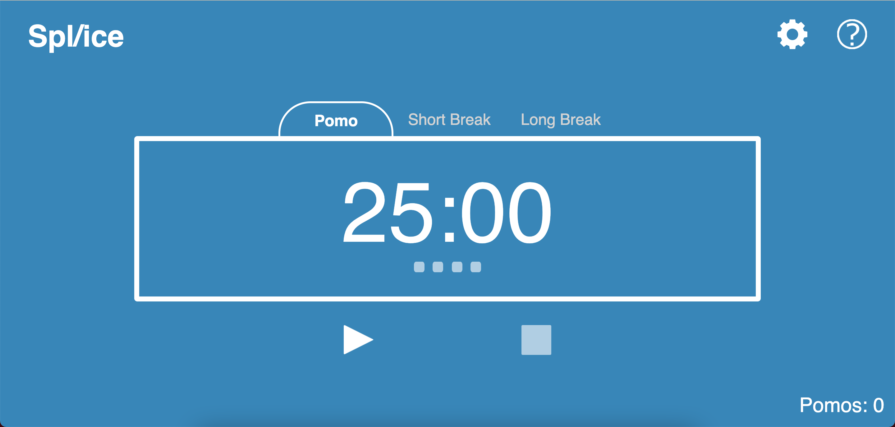
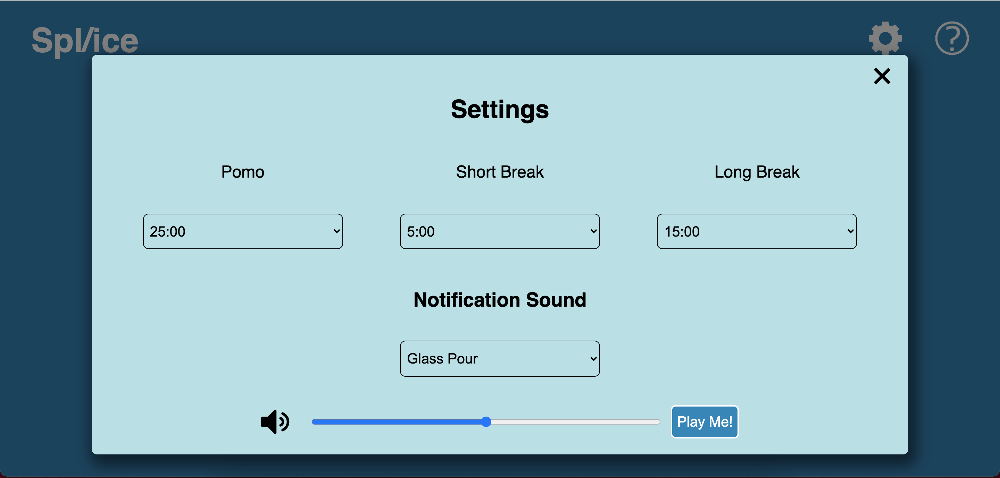
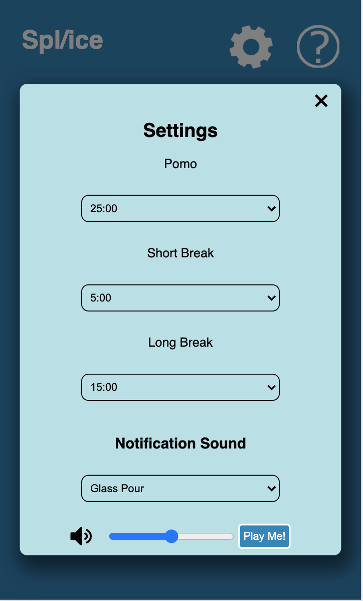
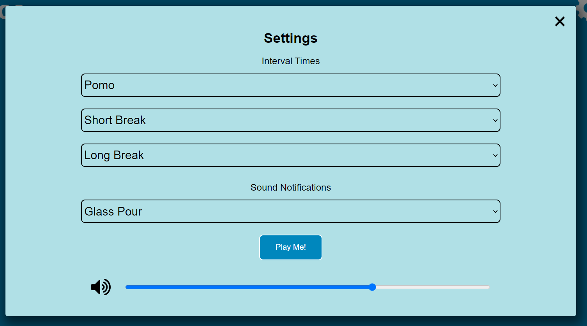
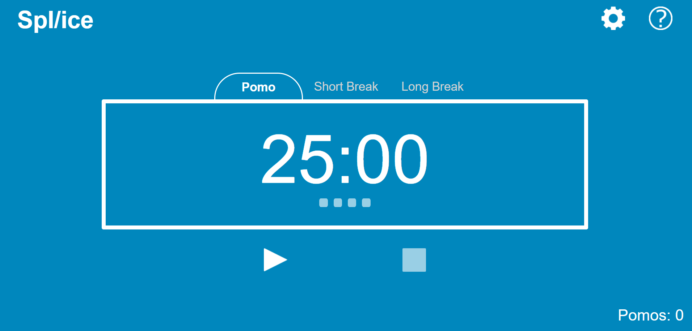

Each member should attend and speak in the meeting and notes, screen captures or even demo videos should be taken.  Attendance should be noted in your meeting notes and the high points saved 

Attendance: Elizabeth, Stephen, Eric, Wilson, Nathan, Jason, Elliot, Ellie, Zane
Unattendence: 

### Ellie
- Plan stretch sprint and divide tasks into issues on github
- Make manual test documentation with Liz
- Update the interface design to add counter, remove tabs for all stages and only have it for current stage, reformat settings
- Fix some inconsistencies in code like innerHTML -> innterText and ''->""

### Elizabeth Morris
- CSS work especially focused on the scaling the website when the screen was resized.
- Touched up JS and tests to match and to help clean up code base in general.
- Helped with keeping the UI overview up to date.
- Helped link necessary issues to pull requests and sort out merge conflicts (esp with the CSS).
- Implemented base "ice cube" square counters in html and CSS for scripting.
- Added Pomo count in bottom right corner during code review and overhauled code to function with said feature.
- Combined Eric and my settings UI implementations to create a desktop and mobile version of the settings menu.

 | 

### Eric Pham
- CSS Tweaking here and there to close some issues
- Created a version of the settings UI that matches the design put forth in the planning documents

### Jason Wong
- Worked on JSDoc headers in javascript files
- Updated comments in javascript files
- Made some of the style changes suggested by Chad
- Changed the timer so that it displays total time of the cycle when stopped
- Kinda wish I did more honestly

### Nathan Kim

### Sicong Duan

### Wilson Low

### Elliot Kim

### Zane Calini
