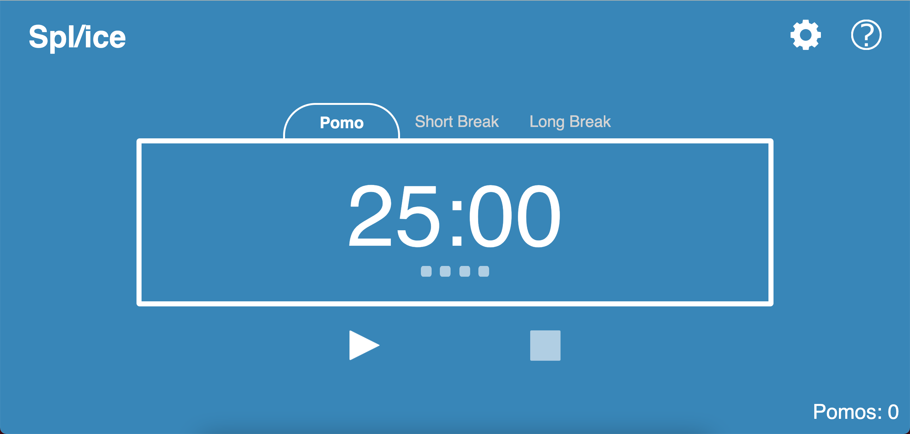
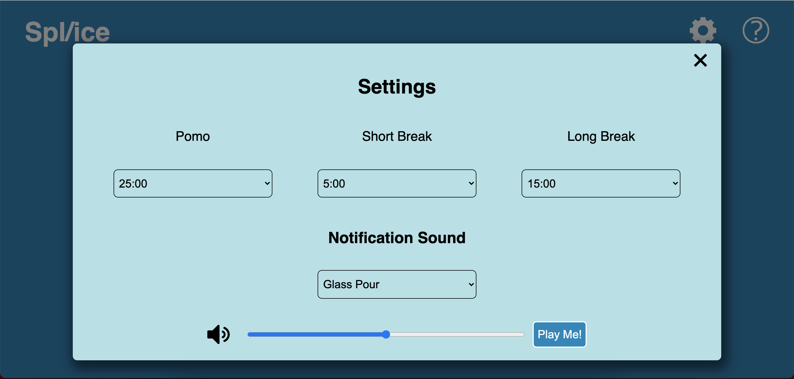
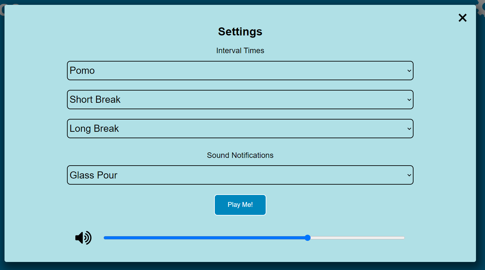

Each member should attend and speak in the meeting and notes, screen captures or even demo videos should be taken.  Attendance should be noted in your meeting notes and the high points saved 

Attendance: Elizabeth, Stephen, Eric, Wilson, Nathan, Jason, Elliot, Ellie, Zane
Unattendence: N/A 

### Ellie
- Plan stretch sprint and divide tasks into issues on github
- Make manual test documentation with Liz
  
- Update the interface design to add counter, remove tabs for all stages and only have it for current stage, reformat settings
- Fix some inconsistencies in code like innerHTML -> innterText and ''->""

### Elizabeth Morris
- CSS work especially focused on the scaling the website when the screen was resized.
- Touched up JS and tests to match and to help clean up code base in general.
- Helped with keeping the UI overview up to date.
- Helped link necessary issues to pull requests and sort out merge conflicts (esp with the CSS).
- Implemented base "ice cube" square counters in html and CSS for scripting.
- Added Pomo count in bottom right corner during code review and overhauled code to function with said feature.
- Combined Eric and my settings UI implementations to create a desktop and mobile version of the settings menu.

 | 

### Eric Pham
- CSS Tweaking here and there to close some issues
- Created a version of the settings UI that matches the design put forth in the planning documents

### Jason Wong
- Worked on JSDoc headers in javascript files
- Manually added JSDocs until we automated it
- Updated comments in javascript files
- Made some of the style changes suggested by Chad
- Changed the timer so that it displays total time of the cycle when stopped

### Nathan Kim
- Worked on customization of settings button features
- Wrote html/css for user adjustments of longbreak,shortbreak, and pomo timers.
- Worked with Elliot on the js for these timer duration settings.

  
### Sicong Duan
- Added HTML and JavaScript code to display the current time left in the web tab. It will display in minutes until it reaches 1 minute, then it will start counting down the seconds 

- Added JavaScript code to resolve issue 72 by modifying the eventListener function for the reset button. Now pressing the reset button will reset the current stage instead of resetting to pomo stage. 
- Added JavaScript code to resolve issue 71 by adding a new controller for each stage change. Now each stage has to be manually started by the user instead of going automatically to the next stage.
- Coded a task list that allows user to keep track of task completed by using custom HTML elements. The user can assign each task estimated pomos will take and mark it completed when it's finished (or cancel it). However due to time constraint, this feature will not be included in the final product. 

- Resolved some merge conflicts

### Wilson Low
- Modified unit tests in CSS Tweaks branch
- Resolved issues with unit tests in dev branch (timer.test.js, controller.test.js, buttons.test.js) to be consistent after merges from feature branches to dev

### Elliot Kim
- Programmed time-changing functionality for drop-down menu in settings page in Javascript 
- Programmed cycle progress indicators (the squares under the timer) in Javascript 
- Made audio play in changeCycles() rather than countdown()
- Slightly adjusted button colors in CSS for non-selected / hover

### Zane Calini
- Set up cypress on project
- Added cypress tests for all End to End testing
- Implemented tests for all html (System level) (Main page, settings page, help page)
- Implemented pseudo unit testing via cypress for timer function as well